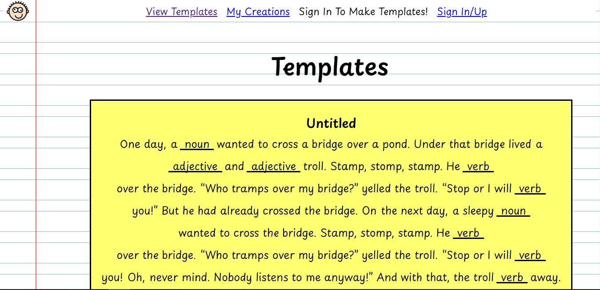
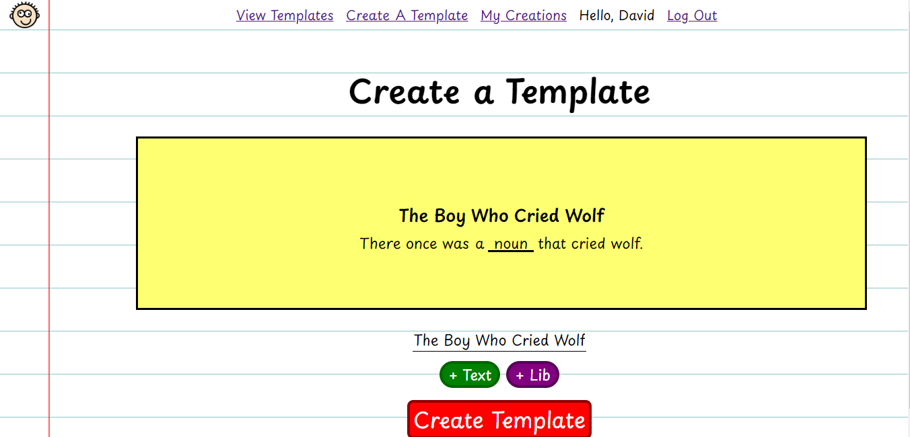
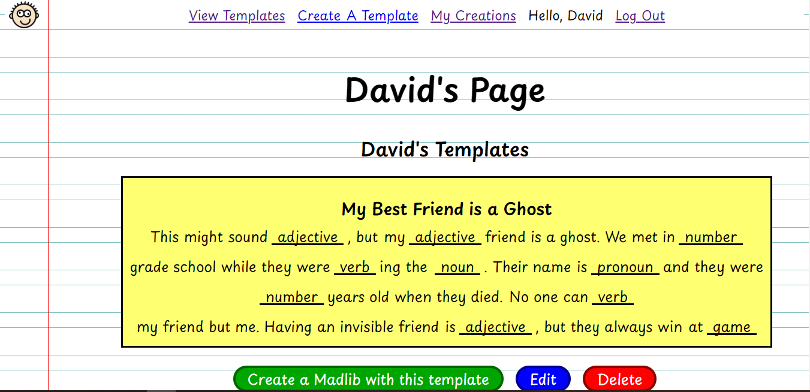
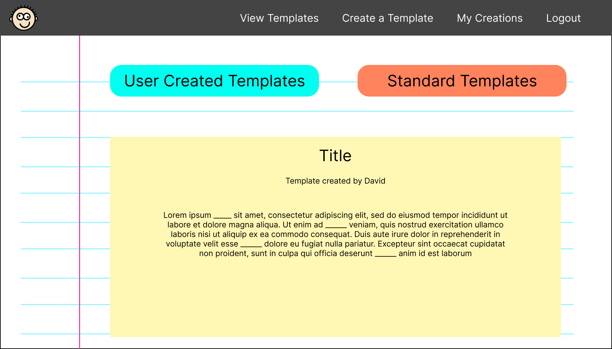
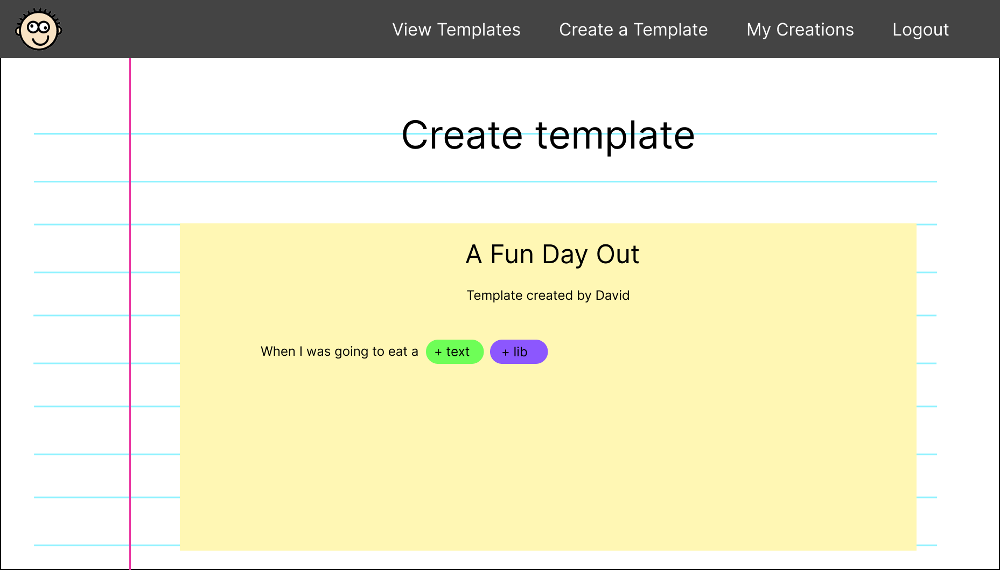
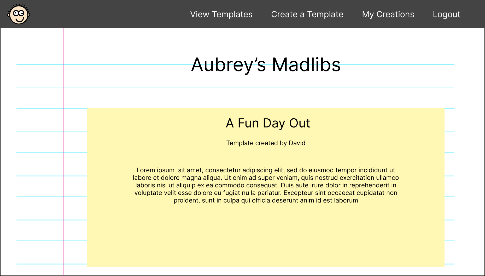

# Madlibs Maker #

## Description ##
This FE/BE application allows you to create Madlibs templates that anyone can use to create their own Madlibs!

## Screenshots ##
Here's some screenshots of the application!  
Template Feed:
  
Creating a Template:
  
Viewing User Page:

## Technologies Used ##
- React
- CSS
- JavaScript
- Express
- Mongoose
- MongoDB
- JSX
- Node

## Getting Started ##
To try out the application, click this link! [Madlibs Maker](https://mad-libs-maker.onrender.com/madlibs) 

## Next Steps ##
The following are features I would like to include in the future:
- The ability to "like" templates
- The ability to download/share madlibs or templates that you've made
- Some animations to breathe life into the application

## Early Wireframes ##
If you're curious to see what the early wireframes for this project were like, check them out!
Early Template Feed:

Early Creating a Template:

Early Viewing User Page:

